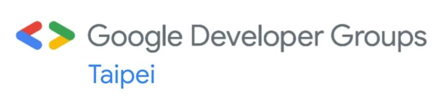
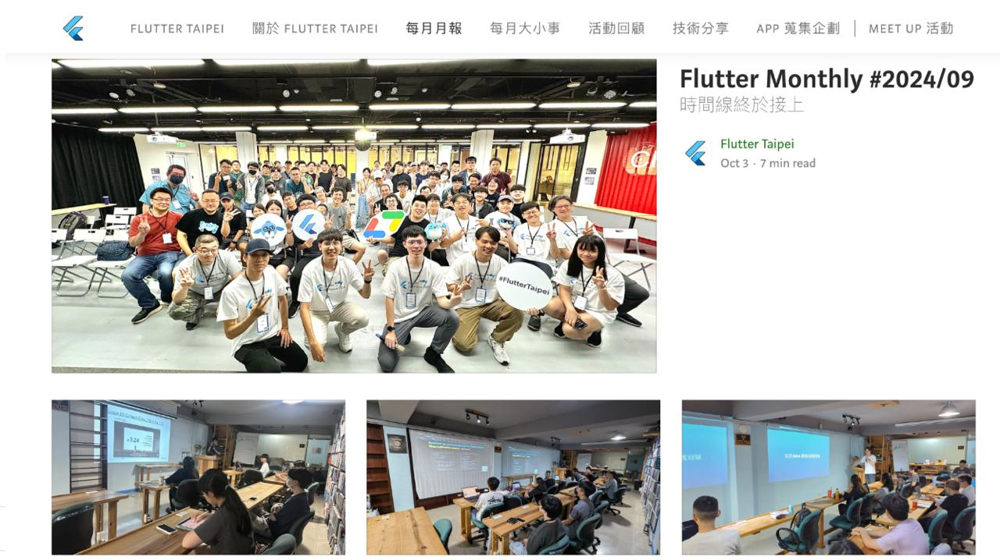
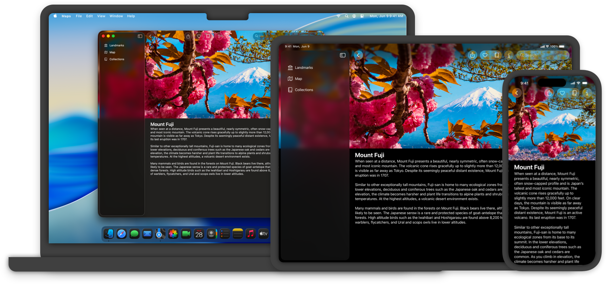
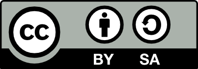

# Flutter 小聚 #25

---

# 小聚說明

- 主辦社群: **GDG Taipei**、**Flutter Taipei**
- 原則上一個月會舉辦一次，時間會在當月**最後一週的週二**
- 地點：**天攏書局 2F**
- 活動主要會分成
  - 當月 Flutter 大小事: 介紹當月 Flutter 相關的大小事
  - 開發者經驗分享: 分享與 Flutter 開發的相關內容，題目不限，可洽志工報名
  - Lightning Talk: 現場/活動事前表單報名，在場有任何想法，可洽志工報名
  - 活動任何問題都可以透過 **Slido** 發問
- 小聚任何行為都參照 GDG 台灣 行為準則 https://gdg.tw/code_of_conduct/
- 下次小聚時間：**2025/07/29**

---

---

---

# COSCUP 2025

---

# Flutter Taipei 每月月報

---

# 上台分享可獲得一個 Pin 針 及 帽子

---

# [Slido](https://app.sli.do/event/foSqFPgdLXht2jtwsS2RQz)

---

# Flutter 六月大小事

## Rainer Fang 

---

# Rainer Fang 

- GDG Taipei Organizer
- Flutter Taipei Organizer
- 專注於 Flutter 的行動應用開發者

---

# WWDC 25

- 新的作業系統: iOS 26、iPadOS 26、macOS Tahoe 26、tvOS 26 
- 視覺風格的挑戰：「Liquid Glass」的導入
- 人工智慧的新機遇：「Apple Intelligence」與 Foundation Models API
- 開發工具與語言的演進：Xcode 26 與 Swift 6.2

[圖片來源](https://developer.apple.com/documentation/technologyoverviews/adopting-liquid-glass)

---

# Just released a Flutter package for Liquid Glass liquid_glass_renderer

[**連結**](https://www.reddit.com/r/FlutterDev/comments/1lb4tqv/just_released_a_flutter_package_for_liquid_glass/)

這是一個新的 Flutter 套件，旨在實現接近「液體玻璃」的視覺效果並支援形狀混合。

---

- **特色:**
  - 接近「液體玻璃」外觀
  - 支援混合多個形狀
  - 可自訂
  - 效能不錯
- **限制:**
  - 目前僅支援 Impeller 渲染引擎
  - 每層最多只能混合三個形狀

---

# Will customers demand liquid glass on apple devices?

[**連結:**](https://www.reddit.com/r/FlutterDev/comments/1l7h2mc/will_customers_demand_liquid_glass_on_apple/)

關於 iOS/iPadOS/macOS 26 的新「液體玻璃」外觀，以及 Flutter 是否能實現此效果的討論。

> [https://developer.apple.com/documentation/technologyoverviews/adopting-liquid-glass](https://developer.apple.com/documentation/technologyoverviews/adopting-liquid-glass)

---

- 作者認為使用目前的 Flutter 引擎很難實現此效果。
- 即使有著色器支援，那些微妙的動畫（如 Tab 視圖的縮放、擺動、收合、展開）也很難實現。
- Apple 也更改了所有尺寸和填充。

---

- **問題探討:**
  - Flutter App 沒有「液體玻璃」外觀是個問題嗎？
  - 繼續使用 Material 風格是否會很快過時？
  - 有什麼方法可以緩解這個問題？

- **Bonus 提醒 (iPadOS 視窗可自由調整大小):**
  - 不要期望應用程式畫面有固定的寬度或高度。
  - 不要試圖透過比較寬高來判斷橫向或縱向模式。

### 更多可查看 Flutter Repo issue  
[Support for iOS 26 “Liquid Glass” Design in Cupertino Widgets #170310](https://github.com/flutter/flutter/issues/170310)

---

# iOS 26 Warning and a (maybe) workaround...

[**連結**](https://www.reddit.com/r/FlutterDev/comments/1l856sr/ios_26_warning_and_a_maybe_workaround/)

關於 iOS 26 與 Flutter `--debug` 模式的相容性問題及其可能的解決方案。
> iOS 26 目前與 Flutter `--debug` 不太相容。

- 這是因為更嚴格的記憶體保護政策，阻止 Dart VM 在 Read-Execute (RX) 和 Read-Write (RW) 模式之間切換記憶體頁面。
- JIT (Just-In-Time) 編譯需要這種切換。

- 作者不確定這是 Apple 試圖阻止 Swift 以外開發的手段，還是單純的 Bug。

---

- **解決方案:**
  - 使用 Profile 模式在裝置上測試 (使用 AOT 編譯而非 JIT)。
  - 在執行 iOS 18.5 的模擬器上進行調試。
  - 僅在發布 TestFlight 前切換到模擬器 iOS 26 和裝置 iOS 26 進行測試。

### 更多可查看 Flutter Repo issue
 [Debug mode and hot reload fail on iOS 26 due to JIT restriction error: mprotect failed: 13 (Permission denied) #163984](https://github.com/flutter/flutter/issues/163984)

---

# No Material 3 Expressive in flutter before a long time...

[**連結**](https://www.reddit.com/r/FlutterDev/comments/1l64ua7/no_material_3_expressive_in_flutter_before_a_long/)

Flutter 團隊關於 Material 3 Expressive 設計語言開發狀態的更新說明。

> 目前，我們並未積極開發 Material 3 Expressive，並且暫時不接受 Expressive 功能或更新的貢獻。

---

# No Material 3 Expressive in flutter before a long time...

**原因:**
- 確保未來採用這些功能時，能與一致的設計模式和規劃好的推出計畫對齊。
- 這有助於提升 Flutter Material 庫的整體品質和可維護性。
- 團隊從 Material 3 遷移中學到了很多經驗，希望在未來的更新中運用這些經驗。
- 團隊會隨著專案和路線圖的演變重新審視此決策。
- 目前希望提前與貢獻者社群溝通並保持透明。

---

# What are the biggest Flutter Apps?

[連結](https://www.reddit.com/r/FlutterDev/comments/1l3facn/what_are_the_biggest_flutter_apps/)

一位有 Flutter 開發經驗的使用者詢問大型 Flutter 應用程式以及大家開發的優秀應用程式。

- 作者有約 5 年的 Flutter 開發經驗。
- 想知道哪些大型應用程式使用了 Flutter。
- 也想了解大家開發的「隱藏版好物」。

---

- **Google Pay**: Google 的行動支付與電子錢包服務，其部分功能或新版本採用了 Flutter 進行開發，是 Flutter 在大型商業應用中一個著名的案例。
- **Nubank**: 來自巴西的數位銀行，是全球最大的獨立數位銀行之一。其行動應用程式完全使用 Flutter 打造，服務數千萬客戶。
- **BMW App**: 知名汽車品牌 BMW 的官方應用程式，用來連接車主與車輛，提供遠端控制、車輛狀態查詢等功能，也是採用 Flutter 開發。
- **eBay Motors**: 知名電商平台 eBay 專為汽機車零件與車輛買賣所推出的應用程式，其介面與功能也是由 Flutter 所驅動。
- **Alibaba (Xianyu - 閒魚)**: 中國電商巨頭阿里巴巴旗下的二手交易平台「閒魚」，是早期採用 Flutter 並獲得成功的知名案例之一。
___

# Thank You!

 
 

###### 本投影片採用
 <a href="https://creativecommons.org/licenses/by-sa/4.0/deed.zh-hant" target="_blank">創用 CC「姓名標示-相同方式分享 4.0 國際」授權條款</a> 釋出
 <a href="https://marp.app/" target="_blank">Marp</a> 製作